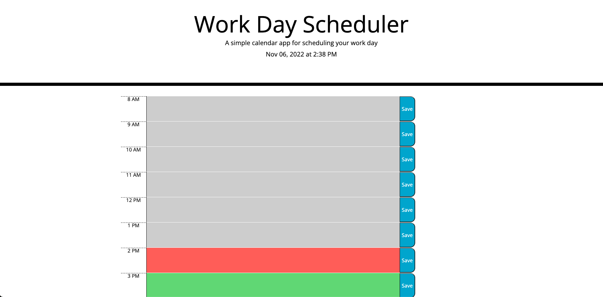

# Work Day Scheduler

## Description

A simple calendar application that allows a user to save events for each hour of the day. This app runs in the browser and features dynamically updated HTML and CSS powered by jQuery.

## User Story

```md
AS AN employee with a busy schedule
I WANT to add important events to a daily planner
SO THAT I can manage my time effectively
```

## Screenshot




## Deployed Link

https://herka10.github.io/Daily-Work-Scheduler/
